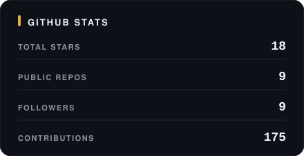
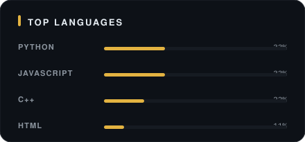

<div align="center">


i find a problem, i fix it — mostly with `c++` & `python`.

</div>

```
$ tree ~/shahab
├── now
│   ├── fastapi × mysql api
│   ├── a minimal portfolio
│   └── still pretending i understand c++ templates
└── stack
    └── c++ · python · fastapi · javascript · mysql · docker · git
```

<div align="center">





</div>

<details>
<summary><code>recent activity</code></summary>

<br>

<div align="center">


</div>

</details>

<div align="center">

[website](https://shahabahmed01.github.io) · [blog](https://shahabcodes.dev) · [linkedin](https://www.linkedin.com/in/shahabahmed01/) · [instagram](https://instagram.com/shahabcodes)

<sub>typed from lahore, pk — kept minimal on purpose</sub>

</div>